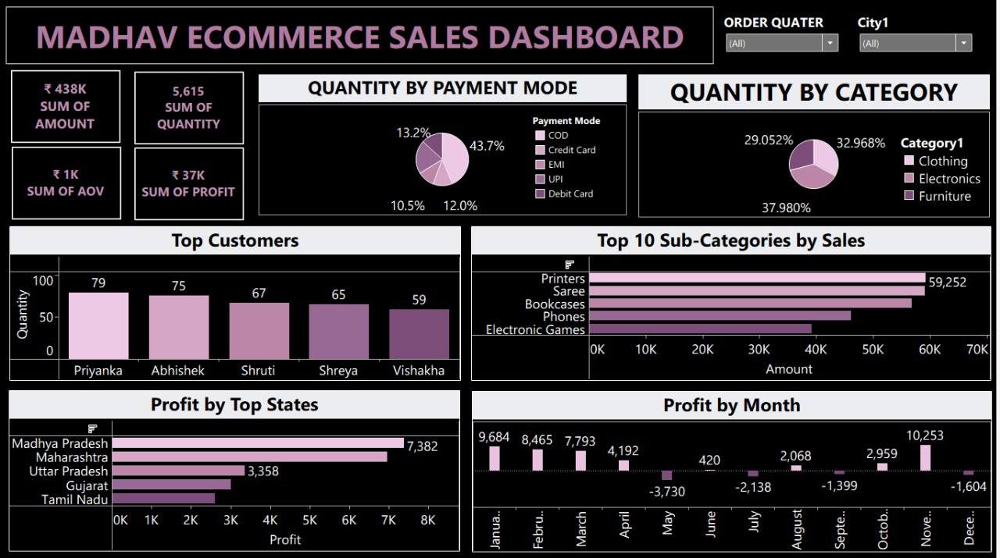

# Tableau Madhav Ecommerce Sales Dashboard 📊

An interactive **Tableau Ecommerce Sales Dashboard** developed to analyze sales amount, quantity, profit, payment modes, product categories, customers, sub-categories, states, and monthly profit performance.

The dashboard provides an interactive business view of Madhav Ecommerce data using Tableau visualizations and filters.

---

## 📌 Dashboard Preview



---

## 📊 Project Overview

The **Tableau Madhav Ecommerce Sales Dashboard** provides a consolidated view of key ecommerce performance metrics and business dimensions.

The dashboard includes KPI cards, payment-mode analysis, category analysis, customer-level analysis, sub-category sales analysis, state-wise profit analysis, and monthly profit trends.

Users can interact with the dashboard using the available **Order Quarter** and **City** filters.

---

## 🎯 Objectives

The main objectives of this dashboard are:

- Analyze overall ecommerce sales performance.
- Track total amount, quantity, AOV, and profit.
- Analyze quantity distribution across different payment modes.
- Compare quantity across product categories.
- Identify customers with the highest purchase quantities.
- Identify the top sub-categories based on sales amount.
- Analyze profit across different states.
- Analyze monthly profit performance.
- Provide an interactive dashboard for business analysis.

---

## 📈 Key Performance Indicators

The dashboard displays the following KPI values in the shown dashboard view:

| Metric | Value |
|---|---:|
| Sum of Amount | ₹438K |
| Sum of Quantity | 5,615 |
| Sum of AOV | ₹1K |
| Sum of Profit | ₹37K |

> **Note:** The dashboard labels the third KPI as **"SUM OF AOV"**. The README therefore preserves the dashboard's terminology rather than assuming a different AOV calculation.

---

## 💳 Quantity by Payment Mode

The dashboard contains a pie chart showing the distribution of quantity across different payment modes.

The payment modes represented in the dashboard are:

- COD
- Credit Card
- EMI
- UPI
- Debit Card

This visualization provides a view of how order quantity is distributed across the available payment methods.

---

## 🛍️ Quantity by Category

The dashboard presents quantity distribution across three product categories:

- Clothing
- Electronics
- Furniture

The displayed proportions are approximately:

- Electronics: **32.968%**
- Clothing: **29.052%**
- Furniture: **37.980%**

---

## 👥 Top Customers

The dashboard contains a **Top Customers** bar chart based on quantity.

The five customers displayed are:

| Customer | Quantity |
|---|---:|
| Priyanka | 79 |
| Abhishek | 75 |
| Shruti | 67 |
| Shreya | 65 |
| Vishakha | 59 |

This visualization highlights customers with the highest quantities in the displayed dashboard view.

---

## 📦 Top 10 Sub-Categories by Sales

The dashboard includes a horizontal bar chart titled:

**Top 10 Sub-Categories by Sales**

The visualization ranks product sub-categories according to sales amount.

Among the clearly visible sub-categories are:

- Printers
- Saree
- Bookcases
- Phones
- Electronic Games

The chart allows comparison of the sales contribution of the highest-performing sub-categories.

---

## 📍 Profit by Top States

The dashboard includes a horizontal bar chart showing profit across selected top-performing states.

The states displayed are:

- Madhya Pradesh
- Maharashtra
- Uttar Pradesh
- Gujarat
- Tamil Nadu

Madhya Pradesh is the highest-profit state shown in the dashboard, with a displayed profit of **7,382**.

Uttar Pradesh is displayed with a profit of **3,358**.

The visualization enables comparison of profitability across different states.

---

## 📅 Profit by Month

The dashboard contains a monthly profit visualization covering the year from January to December.

The displayed monthly profit values are:

| Month | Profit |
|---|---:|
| January | 9,684 |
| February | 8,465 |
| March | 7,793 |
| April | 4,192 |
| May | -3,730 |
| June | 420 |
| July | -2,138 |
| August | 2,068 |
| September | -1,399 |
| October | 2,959 |
| November | 10,253 |
| December | -1,604 |

The visualization highlights both profitable and loss-making months.

November shows the highest displayed monthly profit at **10,253**, while May shows the lowest displayed value at **-3,730**.

---

## 🎛️ Interactive Filters

The dashboard provides interactive filters at the top of the dashboard.

### Order Quarter

Users can filter the dashboard according to the selected order quarter.

### City

Users can filter the dashboard according to city.

These filters allow users to explore the dashboard based on different time and geographic selections.

---

## 📊 Dashboard Components

The dashboard consists of the following visualizations:

1. **KPI Cards**
   - Sum of Amount
   - Sum of Quantity
   - Sum of AOV
   - Sum of Profit

2. **Quantity by Payment Mode**
   - Pie chart

3. **Quantity by Category**
   - Pie chart

4. **Top Customers**
   - Bar chart

5. **Top 10 Sub-Categories by Sales**
   - Horizontal bar chart

6. **Profit by Top States**
   - Horizontal bar chart

7. **Profit by Month**
   - Monthly profit visualization

8. **Interactive Filters**
   - Order Quarter
   - City

---

## 🔍 Key Business Insights

Based on the dashboard view:

- The displayed total amount is approximately **₹438K**.
- The displayed total quantity is **5,615**.
- The displayed total profit is approximately **₹37K**.
- Furniture represents the largest share of quantity among the three displayed categories.
- Priyanka has the highest displayed quantity among the five customers shown.
- Printers are the highest-positioned sub-category in the displayed Top 10 Sub-Categories by Sales chart.
- Madhya Pradesh is the highest-profit state shown.
- Monthly profitability varies considerably throughout the year.
- November records the highest displayed monthly profit.
- Several months show negative profit values, including May, July, September, and December.

---

## 🛠️ Tools & Technologies

- **Tableau** – Data visualization and dashboard development
- **CSV** – Data source
- **Git** – Version control
- **GitHub** – Project hosting and documentation

---

## 📂 Project Structure

```text
Tableau-Madhav-Ecommerce-Sales-Dashboard/
│
├── Details.csv
├── Orders.csv
├── MADHAV_ECOMMERCE_SALES_DASHBOARD.twb
├── dashboard_preview.jpeg
└── README.md
